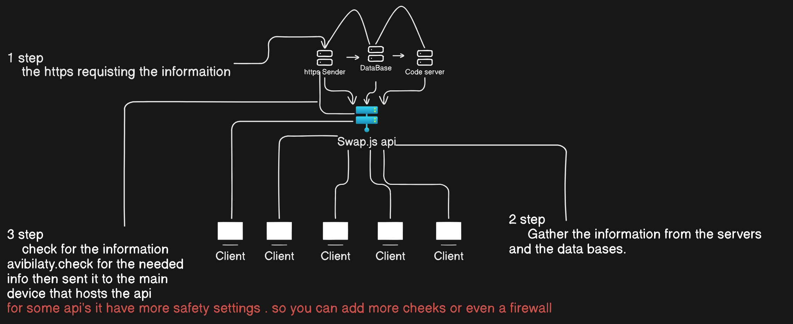

# Swap.js

Swap.js is a powerful and modern backend framework for Node.js, designed to offer a lightweight, efficient, and developer-friendly experience. With modular architecture, dependency injection, and middleware management, it allows you to create scalable backend applications with ease.

## Table of Contents
- [Features](#features)
- [Installation](#installation)
- [Quick Start Guide](#quick-start-guide)
- [Core Concepts](#core-concepts)
  - [App](#app)
  - [Router](#router)
  - [Controllers](#controllers)
  - [Middleware](#middleware)
- [Example Project Structure](#example-project-structure)
- [License](#license)

## Features

- **Lightweight and Fast**: Designed for speed and simplicity.
- **Modular Architecture**: Easily manage application modules.
- **Dependency Injection**: Simplified management of services and dependencies.
- **Middleware Support**: Customize requests with ease.
- **Routing Decorators**: Use decorators like `@Get` and `@Post` for expressive routes.

## Installation

To install Swap.js, ensure you have Node.js installed, then run:

```bash
npm install swapjs-backend
```

## Quick Start Guide

Here’s a basic example of how to set up a simple Swap.js server:

1. **Initialize the Application**

   ```javascript
   const Swap = require('swapjs-backend');
   const app = new Swap.App();

   app.listen(3000, () => {
       console.log("Server running on port 3000");
   });
   ```

2. **Create a Controller**

   Controllers define routes for your application. Here’s an example of a simple controller that responds to a GET request:

   ```javascript
   const { Controller, Get } = require('swapjs-backend').decorators;

   @Controller('/api')
   class ExampleController {
       @Get('/hello')
       helloWorld(req, res) {
           res.send({ message: 'Hello, world!' });
       }
   }

   module.exports = ExampleController;
   ```

3. **Register the Controller in the App**

   To make the controller active, register it with your app in the main file.

   ```javascript
   const ExampleController = require('./controllers/ExampleController');
   app.registerController(ExampleController);
   ```

4. **Run the Server**

   ```bash
   node index.js
   ```

   Visit [http://localhost:3000/api/hello](http://localhost:3000/api/hello) to see your first Swap.js response!

## Core Concepts

### App

The **App** class is the central part of Swap.js. It initializes and configures the server, registers routes, and handles incoming requests.

```javascript
const app = new Swap.App();
app.listen(3000, () => console.log('Server running on port 3000'));
```

### Router

The **Router** manages routes and provides path definitions. You can define routes using decorators within controllers.

### Controllers

Controllers are classes that manage specific routes in your application. Define routes using decorators like `@Controller` for class-level routes and `@Get`, `@Post`, etc., for method-level routes.

Example:
```javascript
const { Controller, Get } = require('swapjs-backend').decorators;

@Controller('/api')
class SampleController {
    @Get('/status')
    getStatus(req, res) {
        res.json({ status: 'active' });
    }
}

module.exports = SampleController;
```

### Middleware

Middleware functions intercept requests and can be used for logging, authentication, or modifying requests and responses.

```javascript
const authMiddleware = (req, res, next) => {
    if (req.headers.authorization) {
        next();
    } else {
        res.status(403).send('Unauthorized');
    }
};
app.useMiddleware(authMiddleware);
```

## Example Project Structure

Here’s an example of a project structure for Swap.js:

```
project-root/
│
├── src/
│   ├── controllers/
│   │   └── ExampleController.js
│   ├── middlewares/
│   │   └── authMiddleware.js
│   ├── services/
│   │   └── ExampleService.js
│   ├── core/
│   │   ├── App.js
│   │   ├── Router.js
│   │   └── Middleware.js
│   └── index.js
│
├── package.json
└── README.md
```

## License

This project is licensed under the MIT License.
 

 # NuggetsTeam
