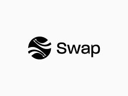

# Swap.js - A Modern JavaScript Backend Framework

`Swap.js` is a powerful, lightweight, and modular Node.js framework for backend development. It comes with built-in Dependency Injection, a flexible router with parameter support, middleware integration, and advanced error handling. This framework is designed to simplify server-side application development while offering extensive customization and scalability.

---

## Table of Contents
1. [Installation](#installation)
2. [Quick Start](#quick-start)
3. [Project Structure](#project-structure)
4. [Creating Controllers](#creating-controllers)
5. [Using Dependency Injection](#using-dependency-injection)
6. [Advanced Routing](#advanced-routing)
7. [Middleware Management](#middleware-management)
8. [Error Handling](#error-handling)
9. [CLI Usage](#cli-usage)
10. [Configuration](#configuration)

---

## 1. Installation

for now . swap.js need more extensions so we can upload it on npm and yearn. but you can add the source code files to your project manually

---

## 2. Quick Start

Start by creating a simple server using `Swap.js`:

```javascript
// index.js
const App = require('swap-js').App;
const { Controller, Get } = require('swap-js').decorators;

@Controller('/api')
class MyController {
  @Get('/greet')
  greet(req, res) {
    res.end('Hello from Swap.js!');
  }
}

const app = new App();
app.registerController(MyController);

app.listen(3000, () => {
  console.log('Swap.js server running on http://localhost:3000');
});
```

Run the server:

```bash
node index.js
```

Visit [http://localhost:3000/api/greet](http://localhost:3000/api/greet) to see the response!

---

## 3. Project Structure

A standard `Swap.js` project structure looks like this:

```plaintext
my-swap-app/
├── src/
│   ├── controllers/
│   │   └── MyController.js
│   ├── middlewares/
│   │   └── authMiddleware.js
│   ├── index.js
├── package.json
└── README.md
```

This structure helps keep controllers and middlewares modular and organized.

---

## 4. Creating Controllers

Controllers in `Swap.js` handle route logic. Use decorators like `@Controller` and `@Get` for cleaner code:

```javascript
// src/controllers/UserController.js
const { Controller, Get, Post } = require('swap-js').decorators;

@Controller('/users')
class UserController {
  @Get('/:id')
  getUser(req, res) {
    res.end(`User ID: ${req.params.id}`);
  }

  @Post('/')
  createUser(req, res) {
    res.end('User created!');
  }
}

module.exports = UserController;
```

---

## 5. Using Dependency Injection

`Swap.js` includes a DI container for managing dependencies across classes, which improves testability and modularity.

1. **Create a Service**:

    ```javascript
    // src/services/UserService.js
    const { Injectable } = require('swap-js').decorators;

    @Injectable()
    class UserService {
      getUsers() {
        return ['Alice', 'Bob', 'Charlie'];
      }
    }

    module.exports = UserService;
    ```

2. **Inject the Service into a Controller**:

    ```javascript
    // src/controllers/UserController.js
    const { Controller, Get } = require('swap-js').decorators;
    const UserService = require('../services/UserService');

    @Controller('/users')
    class UserController {
      constructor(userService = new UserService()) {
        this.userService = userService;
      }

      @Get('/')
      listUsers(req, res) {
        res.end(JSON.stringify(this.userService.getUsers()));
      }
    }

    module.exports = UserController;
    ```

---

## 6. Advanced Routing

`Swap.js` supports dynamic route parameters and nested routes for advanced routing needs.

```javascript
// src/controllers/ProductController.js
const { Controller, Get } = require('swap-js').decorators;

@Controller('/products')
class ProductController {
  @Get('/:id')
  getProduct(req, res) {
    res.end(`Product ID: ${req.params.id}`);
  }

  @Get('/:id/reviews')
  getProductReviews(req, res) {
    res.end(`Reviews for Product ID: ${req.params.id}`);
  }
}

module.exports = ProductController;
```

---

## 7. Middleware Management

Middleware functions in `Swap.js` allow preprocessing of requests or responses. 

1. **Create Middleware**:

    ```javascript
    // src/middlewares/authMiddleware.js
    function authMiddleware(req, res, next) {
      if (!req.headers.authorization) {
        res.statusCode = 401;
        return res.end('Unauthorized');
      }
      next();
    }

    module.exports = authMiddleware;
    ```

2. **Register Middleware**:

    ```javascript
    // index.js
    const authMiddleware = require('./src/middlewares/authMiddleware');
    app.use(authMiddleware);
    ```

---

## 8. Error Handling

`Swap.js` provides a global error handler for structured error responses.

```javascript
// src/middlewares/errorHandler.js
function errorHandler(err, req, res) {
  console.error(`[ERROR]: ${err.message}`);
  res.statusCode = err.statusCode || 500;
  res.end(JSON.stringify({ error: err.message }));
}

module.exports = errorHandler;
```

Register it in your app to handle errors gracefully.

---

## 9. CLI Usage

The `Swap.js` CLI (`swap-cli`) simplifies project scaffolding. Run the following command to create a new project:

```bash
npx swap-cli new my-swap-project
```

This command generates a project structure with a basic server setup in the specified directory.

---

## 10. Configuration

Manage application configuration via the `config` folder.

1. **Default Configuration**:

    ```javascript
    // src/config/default.js
    module.exports = {
      server: {
        port: process.env.PORT || 3000
      },
      logging: {
        level: 'info'
      }
    };
    ```

2. **Using Configuration in the App**:

    ```javascript
    // src/core/app.js
    const config = require('./config/default');

    class App {
      constructor() {
        this.port = config.server.port;
      }

      // Additional methods...
    }
    ```

---

## License

Swap.js is open-source software licensed under the MIT license.

---

With `Swap.js`, you get a modular, configurable, and scalable backend framework that is easy to set up and customize for any project.
```

---

This README introduces `Swap.js`, covers essential and advanced features, and includes example code for each step, making it easy to get started with the framework.
